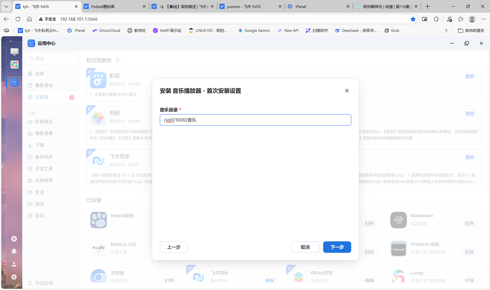
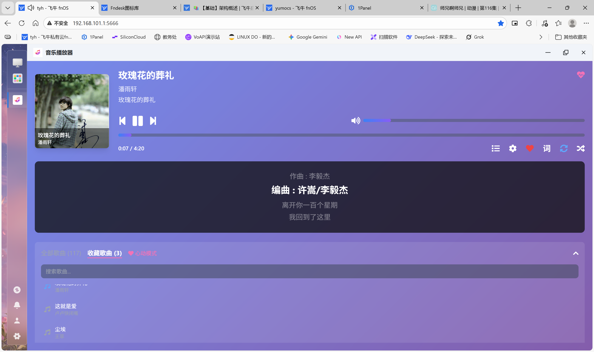

# fnmusic（飞牛桌面应用）

基于 Flask 的本地音乐播放器，已适配为飞牛桌面应用入口（iframe 打开）。默认扫描指定音乐目录，提供播放、收藏与歌词读取能力。
|                      |                      |
| -------------------- | -------------------- |
|  |  |
|  |  |
## 功能

- 扫描音乐目录并生成播放列表（按目录聚合，支持常见音频格式）
- 播放控制：播放/暂停、上一首/下一首、进度与音量控制
- 循环模式：顺序循环 / 随机播放 / 单曲循环
- 收藏（心动模式）：收藏歌曲、仅播放收藏列表
- 歌词：读取同名 `.lrc` 并在前端展示
- 状态记忆：播放器状态写入浏览器本地存储，刷新后可恢复
- 设置页：支持在应用内修改音乐目录并触发重新扫描

## 端口说明

- 当前版本端口固定为 `8090`（不再在安装向导中填写端口）。
- 飞牛桌面入口配置同样固定为 `8090`：`app/ui/config`。

访问地址：`http://<设备IP>:8090/`

## 配置与数据文件

- 配置文件：`config.json`（路径通常为 `${TRIM_PKGVAR}/config.json`）
  - `music_directory`：音乐目录（安装向导写入，或在设置页修改）
  - `port`：会写入 `8090`，但启动端口仍以固定值 `8090` 为准
- 收藏文件：`favorites.json`（路径通常为 `${TRIM_PKGVAR}/favorites.json`）

## 后端 API

后端位于 `app/server/app.py`，主要接口如下：

- `GET /`：前端入口页面
- `GET /api/files`：扫描音乐目录并返回歌曲列表（包含封面/歌词/元数据字段）
- `GET /api/play?path=<文件绝对路径>`：读取并返回音频/封面文件
- `GET /api/lyrics?song_path=<文件绝对路径>`：返回 `.lrc` 歌词行数组
- `GET /api/status`：返回配置与扫描统计（最多统计 20000 个文件）
- `GET /api/config`：返回当前配置（用于设置页展示）
- `POST /api/config/music_directory`：更新音乐目录并立刻生效
- `GET/POST/DELETE /api/favorites`：获取/新增/删除收藏项

说明：后端对 `path` / `song_path` 做了目录边界校验，仅允许访问 `music_directory` 目录下的文件。

## 本地运行（可选）

在本机调试时可直接运行 Flask 服务：

Windows（PowerShell）：

```powershell
python -m venv .venv
\.venv\Scripts\pip install -r fnmusic\app\server\requirements.txt
$env:MUSIC_DIR = "D:\\Music"
python fnmusic\app\server\app.py
```

Linux/macOS：

```bash
python3 -m venv .venv
. .venv/bin/activate
pip install -r fnmusic/app/server/requirements.txt
MUSIC_DIR="/path/to/Music" python fnmusic/app/server/app.py
```

浏览器访问：`http://127.0.0.1:8090/`
